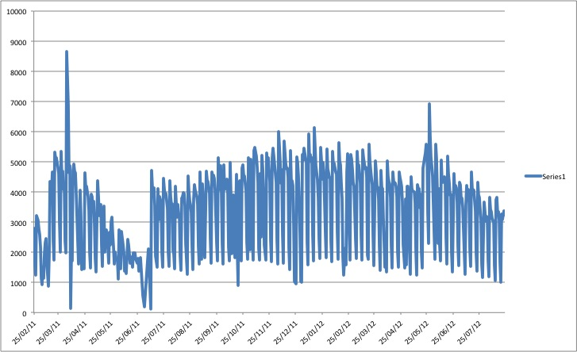
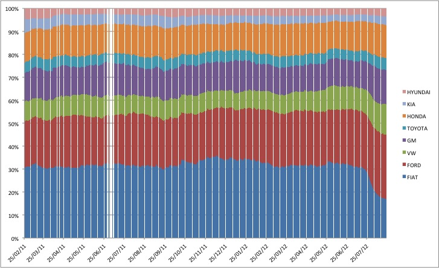
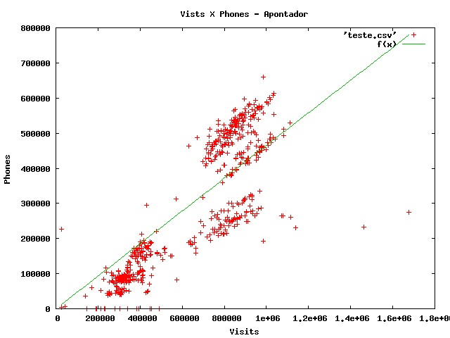
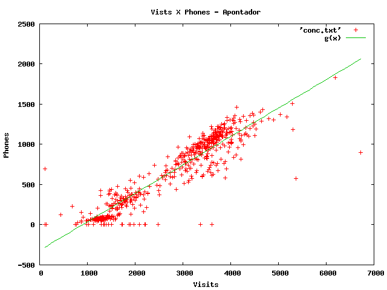
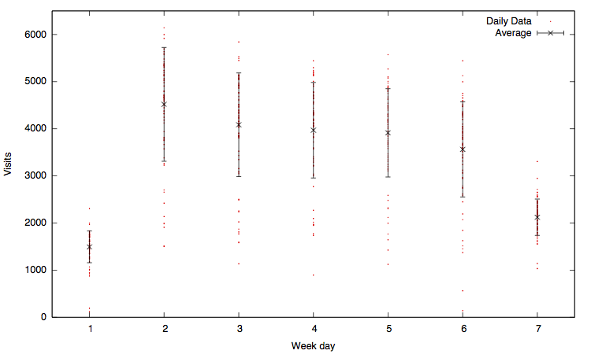
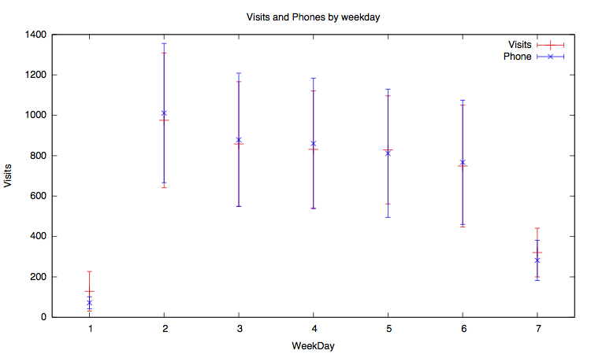
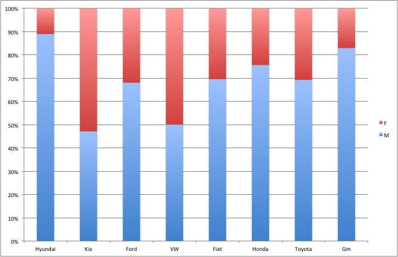
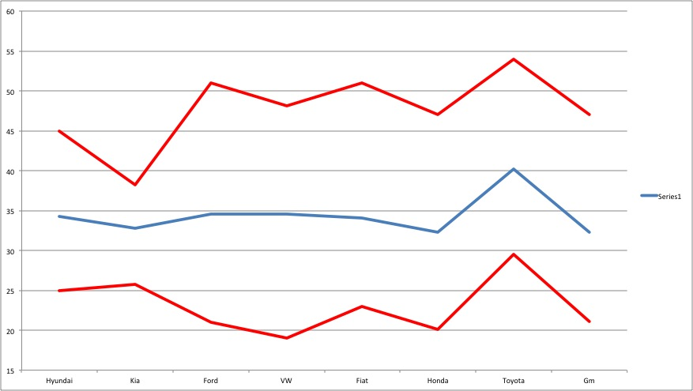

Informações Gerais
=====================

Objetivos
---------------------------
* Analisar o comportamento do usuário [Apontador](www.apontador.com) em relação a concessionárias
* Compreender as diferenças do comportamento deste tipo de usuário ao usuário comum
* Compreender a distribuição temporal e espacial das buscas por concessionárias
* Analisar a existência similaridades de marcas pelas buscas dos usuários

Evolução de visitas a concessionárias no site Apontador
-------------------------------------------------------------

Evolução das visitas de usuários por marca
-----------------------------------------------------------

Comportamento padrão do usuário
----------------------

Comportamento na categoria: Concessionária
-------------------------------

Resultados
-------------------------
$f(x) = ax  + b$

       Total  Concessionárias 
-----  ------ ------------------    
a	   0.4649	0.3540 
b	   0.7391	-318.221

A primeira informação que podemos tirar é que o número de ver telefones para o subgrupo concessárias é proporcionalmente menor que o geral. O usuário geral do site tem 31% de chance a ver telefone que o que procura concessionárias.

Sazonalidade de visitas
----------------------------------

Comparação da Sazonalidade das Visitas vs Ver Telefone
-------------------------------------

Podemos perceber que existe uma aparente mudança da estrutura de visitas nos fins de semana. Apesar de não podermos descartar a hipótese de ser uma questão unicamente estatística, é uma questão que pode necessitar um maior estudo.

Similaridades entre as marcas
--------------------------------
Isso é uma medida de similaridade entre 0 e 1. Ela basicamente indica correlação (é a correlação necessária para explicar a informação mútua observada) de co-ocorrências de diferentes montadoras em visitas de usuários. Quando maior, mas provável é que um usuário que visitou uma também tenha visitado outra. 

Valores maiores que 0.15 podem ser considerados significativos. Eu diria abaixo que os seguintes pares são suficientemente correlacionados para que tenhamos alguma confiança: (FIAT, FORD), (FIAT, GM), (FIAT, HONDA), (FIAT, VW), (FORD, GM), (FORD, HONDA), (FORD, VW), (GM, HONDA).

------------------------------------

                                                                             
  -         FIAT   FORD    GM      HONDA   HYUNDAI     KIA   TOYOTA      VW  
 --------- ------ ------- ------- ------- --------- ------- -------- ------- 
  FIAT      -      0.381   0.286   0.318     0.113   0.140    0.166   0.231  
  FORD      -      -       0.224   0.266     0.085   0.091    0.122   0.185  
  GM        -      -       -       0.186     0.069   0.073    0.089   0.106  
  HONDA     -      -       -       -         0.067   0.102    0.114   0.155  
  HYUNDAI   -      -       -       -             -   0.015    0.029   0.056  
  KIA       -      -       -       -             -       -    0.056   0.080  
  TOYOTA    -      -       -       -             -       -        -   0.051  
 --------- ------ ------- ------- ------- --------- ------- -------- ------- 

Visitas a concessionárias por estado
-------------------------------------------
<iframe src='https://caiocgomes.cartodb.com/tables/conc_1/embed_map' width = '100%' height = '90%'></iframe>

Distribuição da localização de concessionárias pela cidade de São Paulo
--------------------------------------------------------------------------

<iframe src='https://calsaverini.cartodb.com/tables/map/embed_map' width = '100%' height = '90%'></iframe>

Distribuição das visitas pela cidade de São Paulo
----------------------------------------------------------
<iframe src='https://calsaverini.cartodb.com/tables/concessionarias2/embed_map' width = '100%' height = '90%'></iframe>

Informações sobre os usuários
====================================================================

Composição M/F
-------------------------------

Composição Idades
-------------------------------

------------------------

Podemos perceber nesse gráfico que a média de idade para a maior parte das marcas é semelhante. O *outlier* é Toyota, que apresenta uma idade média significamente superior as outras. Isso está de acordo com a visão da marca, que é conhecida por ser preferência de pessoas já mais estabelecidas, e com uma maior idade.

Palavras dos Reviews
=================================================

Comentários Positivos
----------------------------------------

Comentários Negativos
----------------------------------------

-----------------------
Podemos perceber que entre os *reviews* positivos temos a palavra compra e atendimento, que podem demonstrar que uma boa impressão leva a compra nesse POI. 
Entre os negativos, podemos perceber a palavra *peças*, que pode indicar uma reclamação ligada a atendimento de manutenção do veiculo.